# Backend — AskMcNeese (Sprint 1)

> Owner: **Landon Peutera**
> Status: **Not implemented yet — left intentionally for the Backend role.**

This folder is reserved for the FastAPI application that powers AskMcNeese.

## Sprint 1 deliverables for this folder

Per `README.md` and the Sprint 1 plan, the Backend role is responsible for:

1. Bootstrapping a FastAPI app.
2. Exposing a `GET /health` endpoint that returns a simple JSON status.
3. Establishing a clean folder structure for future services (routers, models, services, etc.).
4. Wiring backend logic that the retrieval pipeline (`crawler/`) and frontend (`frontend/`) will later use.

## Suggested starting structure (not yet created)

```
backend/
├── app/
│   ├── __init__.py
│   ├── main.py            # FastAPI entrypoint
│   ├── routers/
│   │   └── health.py      # GET /health
│   ├── models/
│   └── services/
├── requirements.txt
└── README.md              # (this file)
```

## Notes

- Keep `GET /health` lightweight — it is what the frontend pings on load.
- Do NOT add any private, authenticated, or student-record data handling in Sprint 1.
- All retrieval logic that touches public McNeese pages lives in `crawler/`, not here.

---

## How `backend/` and `crawler/` connect

`crawler/` and `backend/` are **two separate components owned by the Backend role**. They
never import each other — they meet at **one shared place: the ChromaDB knowledge store**.

```mermaid
flowchart LR
    subgraph KN["knowledge/"]
        REG["source_registry_seed.csv<br/>(approved sources only)"]
    end

    subgraph CR["crawler/ — OFFLINE ingestion (runs occasionally)"]
        direction TB
        F["crawler.py<br/>fetch approved URL"]
        C["clean_text.py<br/>strip nav/scripts"]
        CH["chunker.py<br/>~300-token chunks + metadata"]
        F --> C --> CH
    end

    subgraph DB["shared store"]
        CHROMA[("ChromaDB<br/>collection: askmcneese_sources")]
    end

    subgraph BE["backend/ — ONLINE API (always running)"]
        API["FastAPI<br/>/health, /ask"]
    end

    subgraph FE["frontend/"]
        UI["student UI"]
    end

    REG -- "allow-list (gate)" --> F
    CH == "WRITE chunks" ==> CHROMA
    UI -- "question" --> API
    API -- "READ / search" --> CHROMA
    CHROMA -- "relevant chunks + source_url" --> API
    API -- "answer + citation" --> UI
```



### The data contract (the part that is "mathematically true")

The relationship is a strict, one-directional flow. Treat these as invariants:

1. **`crawler/` is the only writer** to ChromaDB. `backend/` never writes.
2. **`backend/` is the only reader** at request time. `crawler/` never reads at serve time.
3. **Every chunk a student ever sees originated from an approved URL.** Formally:

   > `served_answer ⊆ ChromaDB ⊆ crawled(approved_sources) ⊆ source_registry`

   Nothing can reach a student that did not pass through the registry allow-list first.
4. **The two run on different clocks:** the crawler runs *occasionally* (refresh), the API
   runs *continuously* (serve). Neither blocks the other — if the crawler is down, the API
   still answers from the last good data.

So `crawler/` being outside `backend/` is intentional: it separates **building the knowledge
base** (offline) from **serving answers** (online), while both stay the Backend role's job.

---

*This README is a placeholder so the folder exists in git and the Backend teammate has a clear starting point.*
