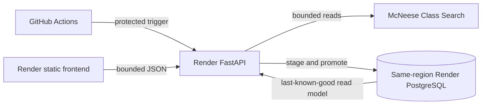
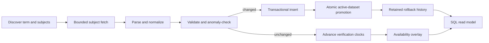

# Class Planner Architecture

## Locked topology

SQLite uses the same SQLAlchemy repository only for local development and tests. `CLASS_DATA_MODE=live` requires a PostgreSQL `DATABASE_URL`; production cannot fall back to SQLite or mock data.

## Data path

The normalized schema covers datasets, terms, source-derived subjects, courses, sections, meetings, instructors, section-instructor relationships, categorized notes, availability overlays, sync runs, per-subject telemetry, locks, and recent course activity. Full datasets are immutable; availability is an independently updatable overlay.

## Search and section loading

Search is SQL-native across normalized course code/title, CRN, and published instructor identity. Registration notes are excluded. Source names and unique initials canonicalize `Computer Science 180` and `cs 180` to `CSCI 180`. PostgreSQL adds `pg_trgm` similarity with GIN indexes for typo tolerance; exact codes rank first.

Search returns course summaries only. Expansion fetches six sections, then explicit `limit`/`offset` pages. Sections rank by schedule fit, then open state, then source section code. Hydration uses fixed bulk meeting, instructor, and note queries—never one query per section.

## Freshness and Add

Responses separate `fetchedAt`, `metadataVerifiedAt`, `availabilityVerifiedAt`, and `availabilityState`. A stale course open queues targeted refresh. Add requests `verify=true` and requires review if key fields changed. If McNeese is unreachable, the stored snapshot remains and Add is allowed with an unable-to-reverify disclosure.

## Reliability and ownership

GitHub Actions owns recurring work; the Render web process has no recurring loop.

- Daily protected full sync for every configured current/next term.
- Five-minute protected availability refresh limited to recently opened courses.
- Owner-token database locks prevent overlapping work.
- One-transaction promotion prevents partial reads.
- Unchanged imports avoid dataset churn.
- Four retained datasets per term support atomic rollback.
- Parser, validation, and anomaly failures preserve last-known-good data.

## API

- `GET /class-planner/terms`
- `GET /class-planner/freshness?term=...`
- `GET /class-planner/courses?term=...&q=...`
- `GET /class-planner/courses/{course_id}`
- `GET /class-planner/courses/{course_id}/sections?term=...&limit=6&offset=0`
- `GET /class-planner/sections/{section_id}?verify=true`
- `POST /class-planner/internal/sync?term=...` (protected)
- `POST /class-planner/internal/availability?term=...` (protected)

The API returns normalized data and provenance, never raw HTML, cookies, secrets, or parser internals.
