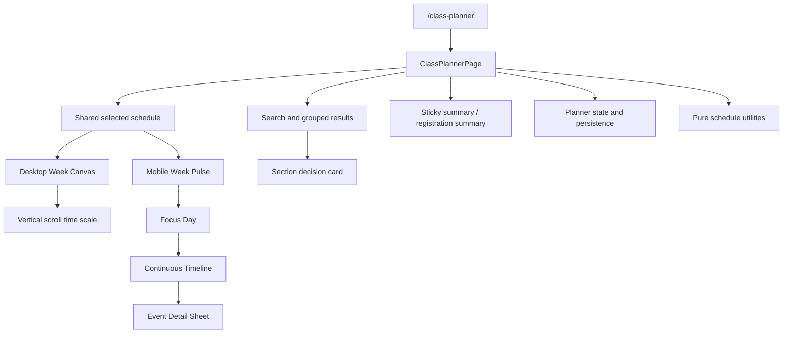
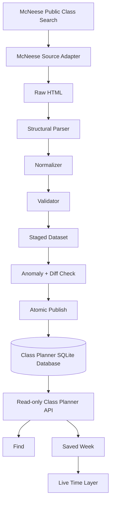
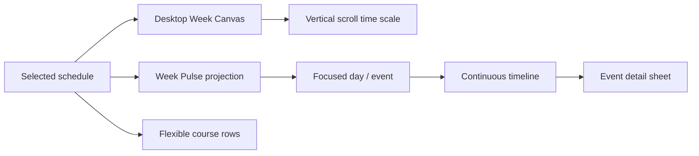
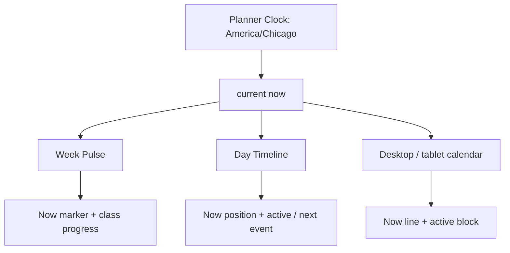

# Class Planner Architecture

## Component architecture

The feature is intentionally compact: one page owns orchestration and cohesive local UI components, while types, API/mock data adapters, deterministic utilities, persistence, and feature CSS remain separate.

## Data flow

The fixed source boundary is `https://schedule.mcneese.edu/`. The adapter uses the verified forms and bounded retries with no user-provided URL. Unfiltered empty-subject POSTs hang on the public Class Search, so full-term synchronization loops the published subject `<select>` and issues one polite subject POST at a time (`CLASS_SOURCE_SUBJECT_DELAY_SECONDS`, default 1s). Synchronization parses into immutable records in memory; only a validated dataset enters a single SQLite transaction. `terms.active_dataset_id` switches at commit, so readers observe the previous complete dataset or the next complete dataset, never a partial import. Old datasets remain available as last-known-good history.

`sync_runs` records counts, parser version, status, timing, and concise errors. A per-term database lock with an owner token prevents overlapping full imports and stops abandoned cleanup from releasing a live owner's lock. The optional process scheduler is disabled by default; when enabled it invokes the same idempotent sync entry point hourly. A cron/platform scheduler can instead run `python -m app.services.class_planner.pipeline --term 202660`.

React does not parse McNeese HTML and no LLM participates in transport, parsing, search, fit, conflict, credit, or persistence.

## State flow

The page maintains a query, filters, expanded course, active mobile mode, selected sections, preview section, focused mobile day, transient notice, source freshness, and registration-summary visibility. `focusedDay` is shared mobile UI state: Week Pulse selection, directional Focus Day content, swipe navigation, and occupancy-segment focus all update it without changing schedule data. Search status is represented explicitly as initial, loading, results, empty, offline, or error. In API mode, canonical saved section IDs are hydrated from the current validated dataset; missing sections are not replaced with mock records. Mobile mode initializes to Week when IDs exist and Find when the schedule is empty.

## Read-only API

- `GET /class-planner/terms`
- `GET /class-planner/courses?term=&q=&open=&online=&days=&time=`
- `GET /class-planner/courses/{courseId}?term=`
- `GET /class-planner/sections/{sectionId}`
- `GET /class-planner/freshness?term=`

Responses contain normalized JSON and source/fetch metadata, never raw HTML, cookies, or parser internals. Search is deterministic over subject, number, title, and published instructor. Normal user search reads SQLite and never contacts McNeese.

## Synchronization and freshness

Full metadata synchronization is designed for an hourly cadence during operational periods, matching McNeese's statement that non-enrollment data updates hourly between 7:00 AM and 4:30 PM. Enrollment fields are captured with each validated import. A public targeted-refresh endpoint is intentionally not exposed: current source testing did not establish a safe low-cost section-only availability contract, so search/Add use the latest published snapshot and show its `fetchedAt` provenance. A future protected refresh path can be added after request cost and abuse controls are verified.

Validation rejects malformed required identity, non-five-digit observed CRNs, duplicate section IDs, invalid days, negative capacity/enrolled values, partial times, and non-increasing fixed time ranges while tolerating absent optional instructors/rooms and source-accurate over-enrollment (`enrolled > capacity` / blank Available on FULL sections). First publication has a configurable minimum section floor. Later imports additionally reject a greater-than-50% count collapse or destructive removal, more than 5% validation rejection, and systemic instructor/meeting loss. HTTP errors, error/login HTML, missing columns, empty results, anomaly failures, and transaction failures mark the run failed while preserving the active dataset.

Provenance is stored per dataset and section (`source_url`, `fetched_at`, parser version, normalized hash). Meaningful section hashes make instructor, meeting, room, status, and availability changes available to the diff counts and future notification work without implementing notifications now.

## Conflict detection

Meetings conflict only when:

1. they share a day;
2. their partial-term date ranges intersect when dates are available; and
3. `candidate.start < existing.end && candidate.end > existing.start`.

Exact boundaries are allowed. The conflict result includes the other course, common days, and overlap minutes. TBA and asynchronous meetings are not treated as time conflicts.

## Persistence

The MVP uses a small versioned local-storage adapter keyed by term and stores canonical section IDs only. Components never access local storage directly. API hydration resolves those IDs to the latest published section metadata, allowing room, instructor, time, and conflict changes to propagate without deleting the student's association. Cross-device schedule persistence remains outside this phase.

## Responsive architecture

Shared data and actions drive two compositions:

- below 768px: Find/Week modes, whole-week Week Pulse, selected Focus Day, continuous timeline, event detail sheet, Flexible rows, and safe-area Find summary;
- 768–1023px: stacked planner content within the existing tablet shell;
- 1024px and above: fixed-width discovery pane plus an available-height calendar viewport with a 68px/hour scroll scale, persistent weekday header, and ghost preview.

Week Pulse is a presentation projection only. A fixed 7 AM–10 PM range and shared `getTimeRatio`, `getTimePosition`, and `getTimeWidth` utilities provide one normalized coordinate system for occupancy segments, temporal landmarks, and axis labels. Every row and the axis use the same CSS Grid day/temporal columns, so label length cannot shift rail geometry. Proportional segment width has a 12px visibility floor, but each start position remains exact. The segments encode time and stable course color, while course text remains in the timeline. Selecting or swiping a day changes only focus state; it does not filter Week Pulse or mutate the schedule. The timeline derives readable event details and 30-minute-or-longer free gaps from the same meetings. The detail sheet reuses the page's dialog focus-management hook and existing Remove action.

The desktop body uses deterministic pixel geometry at 68px per hour instead of percentage heights. Its internal viewport owns vertical scrolling. An initialization effect scrolls near the earliest fixed meeting once; it does not reset after the user interacts.

## Course color and motion

A deterministic course-to-palette map supplies a shared accent, surface tint, and contrast identity to Find results, Week Pulse segments, timeline washes and nodes, detail sheets, and desktop blocks. Conflict state always adds text or iconography and is not communicated by color alone.

Framer Motion is the single motion system. Week Pulse renders one shared-layout Moving Glass Lens (`layoutId="week-pulse-day-lens"`) that physically travels between rows; a short CSS state softens only the departing row while the incoming row resolves to stronger contrast. The lens uses one constant backdrop filter rather than animating blur. Framer Motion also animates directional day replacement, swipe, structural event insertion/removal, event focus, and bottom-sheet entry/exit. Animations use transforms, opacity, and targeted layout transitions rather than animating grid lines or labels. `useReducedMotion` replaces lens travel with a rapid layout/opacity change and removes departing blur, spatial day movement, springs, and smooth event scrolling without changing controls or outcomes.

## Live time architecture

`plannerTime.ts` owns a single external-store clock consumed through `usePlannerNow`. The first subscriber schedules a timeout to the next real minute boundary. Every tick rebuilds state from `Date.now()` rather than incrementing a counter. `visibilitychange` and window `focus` immediately rebuild the snapshot and realign the next tick, so suspended tabs and system-clock changes reconcile without waiting.

All date/time parts are derived with `Intl.DateTimeFormat` in `America/Chicago`. `PLANNER_TERM` carries the official regular-session class start/end dates and published no-class dates. A meeting is eligible for live state only when the McNeese-local date is instructional, its weekday matches, fixed times exist, and optional meeting start/end dates include today.

The deterministic meeting projection returns `inactive`, `upcoming`, `current`, or `completed`, plus clamped progress and minute distances. Course color remains identity; `--planner-live` is a separate semantic emerald used only for current-time lines, nodes, and progress. Week Pulse and calendar positions reuse their existing temporal scales. The timeline places Now proportionally inside the represented current event or free gap; it does not invent a position before the first or after the final represented interval.

The clock store updates only its subscribing schedule components. `ClassPlannerPage`, Find results, filtering, persistence, and search state do not subscribe and therefore do not rerender each minute.

## Integration boundaries

The feature adds one route, one desktop sidebar item, one mobile hamburger item, and the required direct mobile About control. It reuses the public shell, existing tokens, routing, icons, typography, and test stack. Existing Q&A and backend retrieval pipelines remain unchanged.
