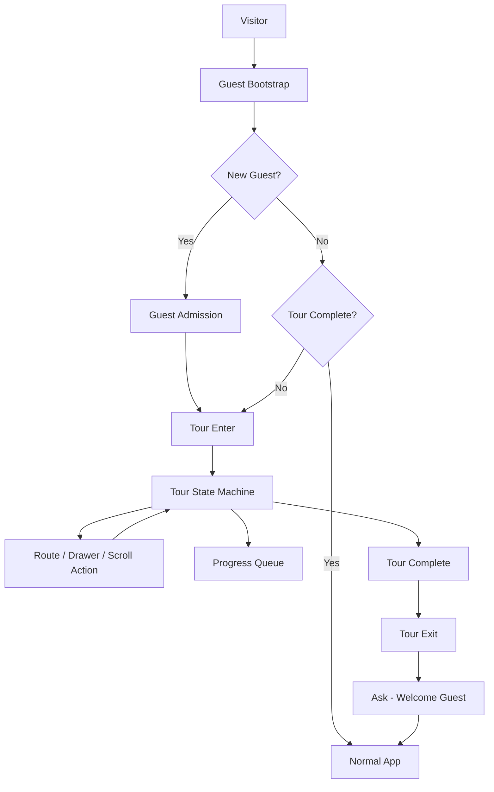

# Onboarding Architecture

## State machine phases

| Phase | Meaning |
| --- | --- |
| `BOOTSTRAPPING` | Calling `POST /guest/bootstrap` |
| `ADMISSION` | New-guest brand canvas acknowledgement |
| `TOUR_ENTERING` | Soft dim + first target resolve |
| `TOUR_ACTIVE` | Normal spotlight / annotation |
| `DRAWER_SUBSTATE` | Mobile menu open required; same conceptual step |
| `ROUTE_TRANSITION` | Clear stale geometry while route settles |
| `GUIDED_READING` | About page readable; scroll completes step |
| `TOUR_COMPLETING` | Final persist in flight |
| `TOUR_EXITING` | Overlay release animation |
| `COMPLETED` | Normal app; optional Welcome Guest |
| `RECOVERABLE_ERROR` | Bootstrap failure or final persist failure only |

## Persistence queue

`TourPersistQueue`:

- one in-flight write
- dedupe identical pending/in-flight/acked steps
- bounded retries (5) with exponential backoff
- optimistic local step changes
- no “Connection needed” copy on ordinary steps

## Browser Back policy

**Policy A:** if the location maps to an earlier conceptual step route, the tour moves back to that step. If an explanation step loses its required route, the controller guides back to that route. Overlay enters `ROUTE_TRANSITION` while geometry resettles.

## Spotlight

Four surrounding scrims dim/blur context (~32–45% dim, ~2.5px blur). Clear zone has no blur. Corner markers + subtle gold halo.

## Annotation

- Desktop: adaptive right/left/bottom/top field (~220–280px), gradient only — no border, radius, or shadow card.
- Mobile: edge caption bottom/top from target midpoint.
- Short tether only when distance is ~20–60px.

## Drawer promotion

`body.tour-drawer-promoted` raises the mobile drawer above tour scrims so menu items stay sharp and tappable. Opening the menu does not increment the global `NN / 14` counter.

## Canonical steps

One `TOUR_STEPS` array (`CANONICAL_STEP_COUNT = 14`). Viewport differences remap targets or open the menu as a substate only.

## Guest API

- `POST /guest/bootstrap` — cookie + public `{ guestId, displayAlias, isNewAssignment, tour }`
- `PATCH /guest/tour` and `POST /guest/tour` — progress
- `POST /guest/tour/replay` — same guest, restart tour
- `POST /guest/dev-reset` — when `ONBOARDING_DEV_RESET` enabled

CORS (credentials): explicit origins from `CORS_ALLOWED_ORIGINS` (alias `CORS_ALLOW_ORIGINS`); methods include `GET`, `POST`, `PATCH`, `OPTIONS`.
